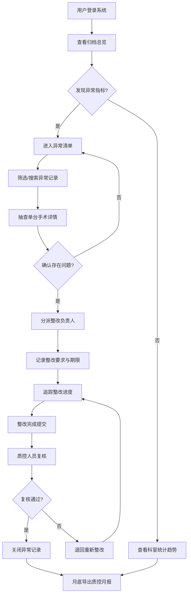

## 1. 产品概述

介入影像归档质控看板是面向医院影像科质控人员和介入中心主任的专业质控管理平台，用于检查介入影像术中资料是否完整、及时、规范。通过数据可视化驱动，帮助管理者从"出了问题才追问"转变为日常化、可视化的主动监督。

- 核心目标：建立介入影像资料全流程质控体系，提升归档率和规范性
- 目标用户：影像科质控人员、介入中心主任、科室质控管理员
- 产品价值：减少医疗纠纷风险，规范诊疗流程，提升科室管理效率

## 2. 核心功能

### 2.1 用户角色

| 角色 | 登录方式 | 核心权限 |
|------|----------|----------|
| 介入中心主任 | 医院统一身份认证 | 查看全部数据、导出月报、配置术式清单、复核整改结果 |
| 影像科质控人员 | 医院统一身份认证 | 查看异常清单、分派整改负责人、记录整改意见、抽查手术详情 |
| 科室质控管理员 | 医院统一身份认证 | 查看本科室统计、处理分派的整改任务、上传整改资料 |

### 2.2 功能模块

1. **归档总览**：手术台次统计、归档完成率趋势、时间维度筛选（日/周/月）、问题概览
2. **异常清单**：异常分类展示（超时归档/资料缺项/患者信息不一致/重复归档）、状态筛选、整改分派
3. **科室统计**：按科室/手术间/设备/术者的多维度趋势分析、对比图表、排名展示
4. **抽查详情**：单台手术归档资料检查（图像/视频/报告关联状态）、必归档项目核对、整改记录

### 2.3 页面详情

| 页面名称 | 模块名称 | 功能描述 |
|----------|----------|----------|
| 归档总览 | KPI 指标卡 | 展示手术总台次、已归档数、归档完成率、异常总数四个核心指标 |
| 归档总览 | 时间趋势图 | 按日/周/月切换展示手术量与归档率趋势折线图 |
| 归档总览 | 问题分布饼图 | 展示各类异常问题占比分布 |
| 归档总览 | 实时动态列表 | 展示最新归档状态变化的手术记录 |
| 异常清单 | 分类统计条 | 按异常类型分类展示数量统计，支持点击筛选 |
| 异常清单 | 异常记录表格 | 展示异常详情（手术信息、异常类型、发现时间、状态、负责人） |
| 异常清单 | 整改分派弹窗 | 选择负责人、填写整改要求、设置整改期限 |
| 异常清单 | 批量操作 | 支持批量分派、批量导出 |
| 科室统计 | 维度切换器 | 切换科室/手术间/设备/术者四个分析维度 |
| 科室统计 | 排名柱状图 | 展示各维度的手术量和异常率排名 |
| 科室统计 | 趋势对比图 | 多维度数据趋势对比折线图 |
| 科室统计 | 数据明细表 | 详细统计数据表格，支持排序和导出 |
| 抽查详情 | 手术基本信息 | 展示患者信息、手术信息、术者、时间等 |
| 抽查详情 | 归档资料清单 | 展示图像/视频/报告的归档状态和关联情况 |
| 抽查详情 | 必归档项目核对表 | 按术式展示必归档项目，标记完成/缺失状态 |
| 抽查详情 | 整改记录时间线 | 展示问题发现、分派、整改、复核的全流程记录 |
| 抽查详情 | 整改操作区 | 填写整改结果、上传凭证、提交复核 |
| 全局 | 顶部导航栏 | Logo、模块切换、用户信息、消息通知 |
| 全局 | 侧边筛选栏 | 时间范围、科室、术式等多条件筛选 |
| 全局 | 术式配置页 | 设置不同术式的必归档项目清单（管理员） |
| 全局 | 月报导出 | 一键生成并导出质控月报 PDF/Excel |

## 3. 核心流程

质控人员日常巡检流程：登录系统 → 查看归档总览发现异常 → 进入异常清单定位问题 → 抽查手术详情确认问题 → 分派整改负责人 → 追踪整改进度 → 复核整改结果 → 月底导出质控月报。

## 4. 用户界面设计

### 4.1 设计风格

- **主色调**：医疗蓝 `#1A73E8`（专业、信任），辅助色：深青 `#00897B`（成功）、橙红 `#E65100`（警告）、深红 `#C62828`（严重异常）
- **背景色**：极浅灰蓝 `#F5F7FA`，卡片背景纯白 `#FFFFFF`
- **按钮风格**：圆角 6px，主按钮实心蓝色，次按钮描边灰色，危险按钮橙红色
- **字体**：标题使用思源宋体（正式、专业），正文使用思源黑体（清晰易读），数字使用等宽字体
- **字号层级**：页面标题 24px 粗体，模块标题 18px 半粗，正文 14px 常规，辅助文字 12px 浅色
- **布局风格**：卡片式布局，顶部通栏导航 + 左侧筛选区 + 主内容区，数据看板采用网格化 KPI 卡 + 图表组合
- **图标风格**：线性简洁图标，统一 2px 线宽，颜色与对应语义匹配
- **整体调性**：专业医疗级，数据密集但信息层次清晰，减少装饰性元素，强调功能性和可读性

### 4.2 页面设计概览

| 页面名称 | 模块名称 | UI 元素 |
|----------|----------|---------|
| 归档总览 | KPI 指标卡 | 大数字 + 环比趋势箭头 + 迷你折线图，卡片带微阴影，hover 轻微上浮 |
| 归档总览 | 时间趋势图 | 双 Y 轴折线图（手术台次柱状 + 归档率折线），数据点悬停显示详情 |
| 归档总览 | 问题分布饼图 | 环形图，中心显示异常总数，各扇区不同颜色标记异常类型 |
| 归档总览 | 实时动态列表 | 时间线式布局，每条记录带状态标签（绿色已归档/橙色待归档/红色异常） |
| 异常清单 | 分类统计条 | 横向标签栏，每个标签显示数量徽标，选中状态带下划线高亮 |
| 异常清单 | 异常记录表格 | 斑马纹行，状态列彩色标签，操作列悬停显示按钮，支持行选中 |
| 异常清单 | 整改分派弹窗 | 居中模态框，表单布局，负责人下拉搜索，日期选择器 |
| 科室统计 | 维度切换器 | Tab 切换（科室/手术间/设备/术者），带下划线动画 |
| 科室统计 | 排名柱状图 | 水平条形图，按异常率降序，条形颜色渐变表示严重程度 |
| 科室统计 | 数据明细表 | 支持列排序，数值列右对齐，支持列显示配置 |
| 抽查详情 | 归档资料清单 | 三栏卡片布局（图像/视频/报告），每栏显示数量和缩略图，缺失项红色边框高亮 |
| 抽查详情 | 必归档项目核对表 | 清单式布局，每项前有勾选框（绿色已完成/红色缺失），支持分组折叠 |
| 抽查详情 | 整改记录时间线 | 垂直时间线，节点图标表示阶段（发现/分派/整改/复核），节点颜色表示状态 |

### 4.3 响应式设计

- 桌面端优先设计（1440px 基准），适配 1280px 及以上
- 平板端（768-1279px）：侧边筛选栏收起为抽屉，图表自适应缩放
- 移动端（<768px）：顶部导航简化，KPI 卡堆叠，表格转为卡片列表

### 4.4 动效与交互

- 页面加载：KPI 卡数字从 0 滚动到目标值，图表依次淡入（staggered animation）
- 交互反馈：按钮 hover 背景色变化 + 轻微缩放，卡片 hover 阴影加深 + 2px 上浮
- 数据更新：指标变化时数字闪动，新异常记录出现时有滑入动画
- 弹窗过渡：缩放淡入（scale 0.9→1，opacity 0→1，200ms ease-out）
- 图表交互：数据点 hover 时显示 tooltip，点击图表区域联动筛选表格数据
