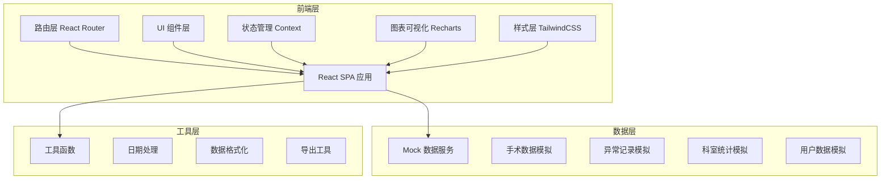
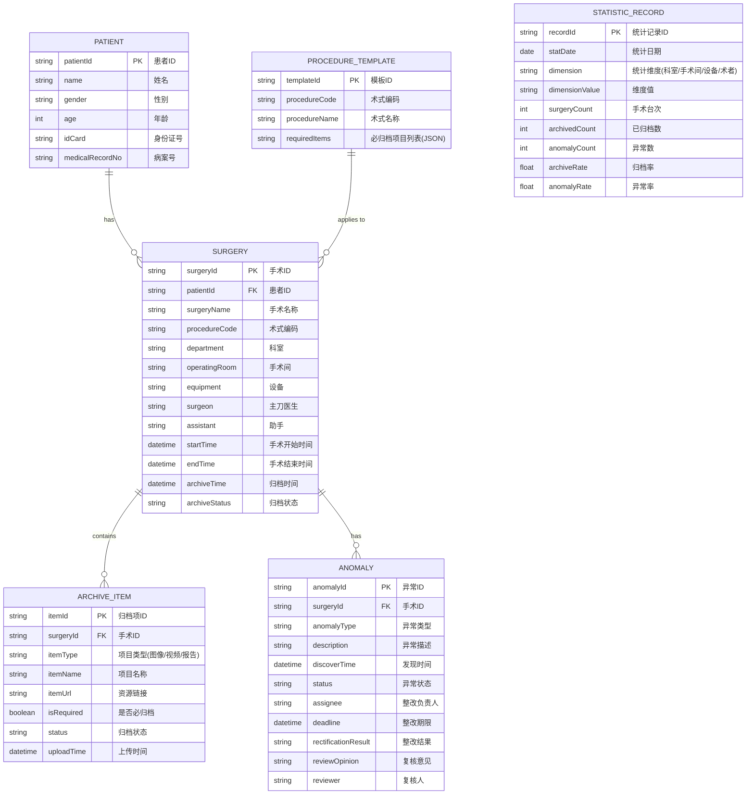

## 1. 架构设计



## 2. 技术描述

- **前端框架**: React@18 + TypeScript
- **构建工具**: Vite@5
- **样式方案**: TailwindCSS@3 + PostCSS
- **路由管理**: React Router@6
- **图表可视化**: Recharts@2
- **状态管理**: React Context + useReducer（轻量状态管理，无需 Redux）
- **图标库**: Lucide React（线性简洁图标，符合医疗专业调性）
- **数据层**: 本地 Mock 数据（模拟后端接口），采用工厂模式生成测试数据
- **工具库**: date-fns（日期处理）、xlsx（Excel 导出）

## 3. 路由定义

| 路由路径 | 页面组件 | 功能说明 |
|----------|----------|----------|
| `/` | 重定向到 `/overview` | 首页默认跳转归档总览 |
| `/overview` | OverviewPage | 归档总览：KPI 指标、趋势图、问题分布、实时动态 |
| `/anomalies` | AnomaliesPage | 异常清单：分类筛选、异常列表、整改分派 |
| `/statistics` | StatisticsPage | 科室统计：多维度趋势、排名对比、数据明细 |
| `/surgery/:id` | SurgeryDetailPage | 抽查详情：单台手术归档检查、整改记录 |
| `/procedure-config` | ProcedureConfigPage | 术式配置：设置各术式必归档项目（管理员） |

## 4. 数据模型

### 4.1 ER 关系图



### 4.2 核心数据类型定义 (TypeScript)

```typescript
// 患者信息
interface Patient {
  patientId: string;
  name: string;
  gender: '男' | '女';
  age: number;
  idCard: string;
  medicalRecordNo: string;
}

// 手术信息
interface Surgery {
  surgeryId: string;
  patientId: string;
  patient: Patient;
  surgeryName: string;
  procedureCode: string;
  procedureName: string;
  department: string;
  operatingRoom: string;
  equipment: string;
  surgeon: string;
  assistant: string;
  startTime: string;
  endTime: string;
  archiveTime?: string;
  archiveStatus: 'pending' | 'archived' | 'overdue' | 'anomaly';
  archiveItems: ArchiveItem[];
  anomalies: Anomaly[];
}

// 归档项
interface ArchiveItem {
  itemId: string;
  surgeryId: string;
  itemType: 'image' | 'video' | 'report';
  itemName: string;
  thumbnailUrl?: string;
  itemUrl?: string;
  isRequired: boolean;
  status: 'archived' | 'missing' | 'mismatch';
  uploadTime?: string;
}

// 异常记录
interface Anomaly {
  anomalyId: string;
  surgeryId: string;
  surgery: Surgery;
  anomalyType: 'overdue' | 'missing_items' | 'patient_mismatch' | 'duplicate';
  anomalyTypeName: string;
  description: string;
  discoverTime: string;
  status: 'pending' | 'assigned' | 'rectifying' | 'reviewing' | 'closed' | 'rejected';
  statusName: string;
  assignee?: string;
  deadline?: string;
  rectificationResult?: string;
  reviewOpinion?: string;
  reviewer?: string;
  rectificationTimeline: RectificationRecord[];
}

// 整改记录
interface RectificationRecord {
  recordId: string;
  anomalyId: string;
  action: string;
  operator: string;
  operateTime: string;
  remark?: string;
  attachmentUrl?: string;
}

// 术式配置模板
interface ProcedureTemplate {
  templateId: string;
  procedureCode: string;
  procedureName: string;
  requiredItems: RequiredItem[];
}

interface RequiredItem {
  itemId: string;
  itemName: string;
  itemType: 'image' | 'video' | 'report';
  description: string;
}

// 统计数据
interface StatisticData {
  statDate: string;
  dimension: 'department' | 'operatingRoom' | 'equipment' | 'surgeon';
  dimensionValue: string;
  surgeryCount: number;
  archivedCount: number;
  anomalyCount: number;
  archiveRate: number;
  anomalyRate: number;
}

// KPI 指标
interface KPIData {
  totalSurgeries: number;
  archivedSurgeries: number;
  archiveRate: number;
  totalAnomalies: number;
  compareLastPeriod: {
    surgeries: number;
    archiveRate: number;
    anomalies: number;
  };
}

// 全局筛选条件
interface FilterCondition {
  timeRange: 'day' | 'week' | 'month' | 'custom';
  startDate?: string;
  endDate?: string;
  departments: string[];
  procedureCodes: string[];
}
```

## 5. 项目目录结构

```
src/
├── assets/                 # 静态资源
│   └── images/
├── components/             # 公共组件
│   ├── layout/            # 布局组件
│   │   ├── Header.tsx
│   │   ├── Sidebar.tsx
│   │   └── PageContainer.tsx
│   ├── ui/                # UI 基础组件
│   │   ├── Card.tsx
│   │   ├── Button.tsx
│   │   ├── Tag.tsx
│   │   ├── Modal.tsx
│   │   ├── Table.tsx
│   │   ├── Select.tsx
│   │   ├── DatePicker.tsx
│   │   └── Input.tsx
│   ├── charts/            # 图表组件
│   │   ├── KPICard.tsx
│   │   ├── TrendChart.tsx
│   │   ├── PieChart.tsx
│   │   └── BarChart.tsx
│   └── common/            # 业务组件
│       ├── FilterBar.tsx
│       ├── AnomalyTag.tsx
│       ├── StatusBadge.tsx
│       └── Timeline.tsx
├── pages/                  # 页面组件
│   ├── OverviewPage.tsx
│   ├── AnomaliesPage.tsx
│   ├── StatisticsPage.tsx
│   ├── SurgeryDetailPage.tsx
│   └── ProcedureConfigPage.tsx
├── data/                   # Mock 数据
│   ├── surgeryData.ts
│   ├── anomalyData.ts
│   ├── statisticData.ts
│   └── procedureTemplate.ts
├── context/                # 状态管理
│   ├── AppContext.tsx
│   └── FilterContext.tsx
├── utils/                  # 工具函数
│   ├── dateUtils.ts
│   ├── formatUtils.ts
│   ├── exportUtils.ts
│   └── mockDataFactory.ts
├── types/                  # 类型定义
│   └── index.ts
├── hooks/                  # 自定义 Hooks
│   ├── useKPIData.ts
│   ├── useAnomalyList.ts
│   └── useStatisticData.ts
├── App.tsx
├── main.tsx
└── index.css
```

## 6. 状态管理方案

采用 React Context + useReducer 的轻量级方案，分两个 Context：

1. **AppContext**：全局应用状态（用户信息、通知、弹窗）
2. **FilterContext**：全局筛选条件（时间范围、科室、术式），跨页面共享

各页面内的业务数据使用自定义 Hooks（如 `useKPIData`, `useAnomalyList`）管理，通过 React Query 风格的缓存策略（useMemo/useCallback）优化性能。

## 7. 性能优化策略

- 图表数据使用 `useMemo` 缓存计算结果
- 大表格采用虚拟滚动（如数据量超过 100 条）
- 图片使用懒加载 + WebP 格式
- 路由级代码分割（React.lazy + Suspense）
- TailwindCSS 使用 PurgeCSS 移除未使用样式
